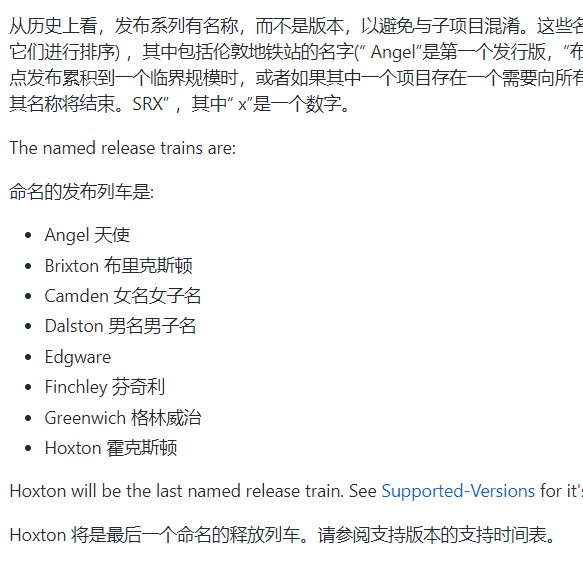
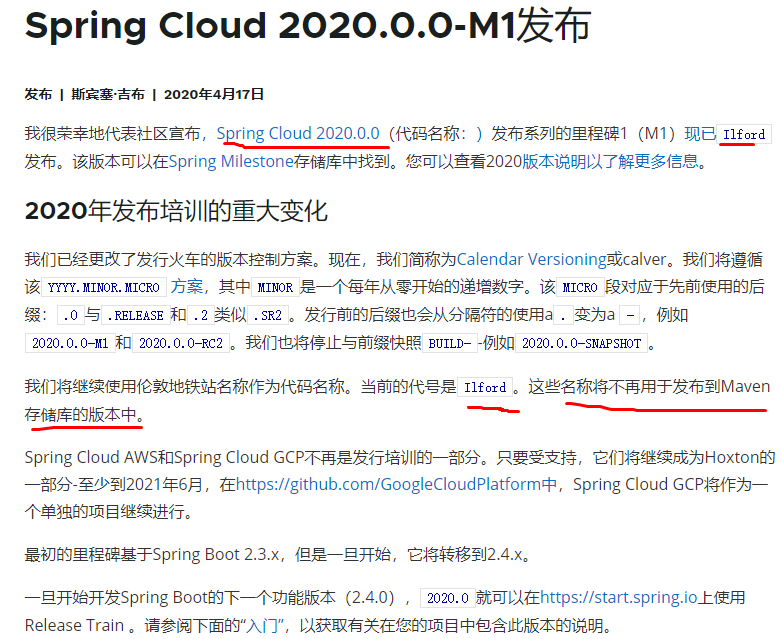
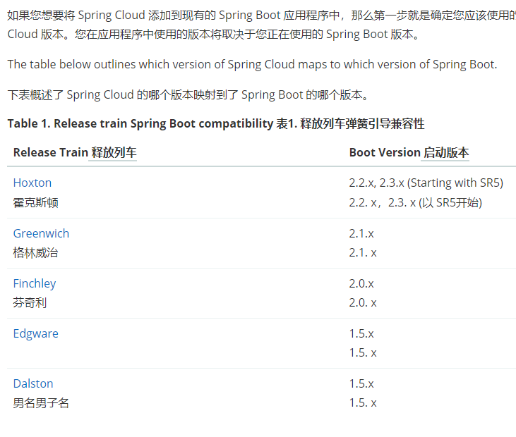

- [spring-cloud-study](#spring-cloud-study)
  - [1. 开始](#1-开始)
    - [1.1 spring-cloud命名](#11-spring-cloud命名)
    - [1.2 spring clound和spring boot版本关系](#12-spring-clound和spring-boot版本关系)
    - [1.99 code](#199-code)
  - [99. 参考](#99-参考)
    - [1. config](#1-config)
      - [1.1 <https://www.cnblogs.com/fengzheng/p/11242128.html>](#11-httpswwwcnblogscomfengzhengp11242128html)
        - [1) 基础实现](#1-基础实现)
        - [2) 结合actuator，可以通过调接口的方式手动触发刷新配置](#2-结合actuator可以通过调接口的方式手动触发刷新配置)
        - [3) 在 github 中配置 Webhook](#3-在-github-中配置-webhook)
        - [4) 使用 Spring Cloud Bus 来自动刷新多个客户端](#4-使用-spring-cloud-bus-来自动刷新多个客户端)
        - [5)](#5)

# spring-cloud-study

## 1. 开始

### 1.1 spring-cloud命名

名称是按字母顺序排列的，带有伦敦地铁站的名称



版本名称变化



可以从以下maven库中看到maven版本version的变化，从伦敦地铁站改变到yyyy.minor.xxx(Calendar Versioning)。<https://repo.spring.io/milestone/org/springframework/cloud/spring-cloud-dependencies/>


### 1.2 spring clound和spring boot版本关系



### 1.99 code

spring-cloud-samples


## 99. 参考
### 1. config
#### 1.1 <https://www.cnblogs.com/fengzheng/p/11242128.html>
##### 1) 基础实现
参照这个实现了config服务端，实现见cloud-config-server，然后客户端使用config的git仓库配置，实现见cloud-config-client和spring-study/springboot2.
**Spring Cloud Config client在项目启动时加载配置内容这一机制，导致了它存在一个缺陷，修改配置文件内容后，不会自动刷新。**要刷新配置需要重启客户端微服务，不好。
##### 2) 结合actuator，可以通过调接口的方式手动触发刷新配置
（需要读取配置的类上增加@RefreshScope注解，这里不加注解调接口也可以更新配置。）
调用 post http://localhost:3302/actuator/refresh。之后再调用http://localhost:3302/show2，发现配置已经变了；但是调用http://localhost:3302/show配置没变，这和@Value 注解的实现有关，和@RefreshScope无关，所以，我们在项目中就不要使用这种方式加载配置了，而是使用@ConfigurationProperties(prefix = "xx")
> 引入spring-boot-starter-actuator 包，增加如下配置：
```yml
management:
  endpoint:
    shutdown:
      enabled: false
  endpoints:
    web:
      exposure:
        include: "*"
```
##### 3) 在 github 中配置 Webhook
每次更改配置后，手动用postman调用一下客户端的更新接口，不方便。github提供了webhook方式，当有代码变更时，会调用我们设置的地址，可以达到自动调用接口的方式。但这个接口在内网，github不一定能访问到。有的公司如果使用了自建gitlab，也有webhook功能，这样就可以调到内网地址了。

##### 4) 使用 Spring Cloud Bus 来自动刷新多个客户端
如果只有一个client端，用webhook刷新还不算费事，如果有多个一个个手动刷新太麻烦（我：不过应该可以写个接口去调这些client的refresh接口，调用这个接口就能更新所有的client）。  
现成的我们可以借助 Spring Cloud Bus 的广播功能，让 client 端都订阅配置更新事件，**当配置更新时，触发其中一个端的更新事件，Spring Cloud Bus 就把此事件广播到其他订阅端，以此来达到批量更新。**

配置更新后，访问其中一个的 /actuator/bus-refresh 地址，所有端都会更新。

// todo 有时间实现

##### 5)
一个配置中心服务器可能会挂掉，使用eureka管理多个配置中心服务端，以实现高可用。
